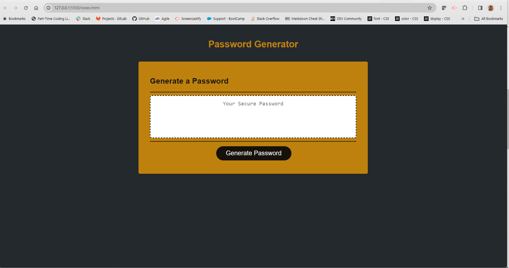

# 03 JavaScript: Password Generator

## My Task
This week's Challenge required me to modify  starter code located in the Develop foler to create an application that enables employees to generate random passwords based on criteria that they’ve selected. This app will run in the browser and will feature dynamically updated HTML and CSS powered by JavaScript code. It will have a clean and polished, responsive user interface that adapts to multiple screen sizes.

I have utilized the OWASP Foundation list of Characters to allow the user selct special characters

## User Story
```
AS A marketing agency
I WANT a codebase that follows accessibility standards
SO THAT our own site is optimized for search engines
```

## Acceptance Chriteria

```
GIVEN I need a new, secure password
WHEN I click the button to generate a password
THEN I am presented with a series of prompts for password criteria
WHEN prompted for password criteria
THEN I select which criteria to include in the password
WHEN prompted for the length of the password
THEN I choose a length of at least 8 characters and no more than 128 characters
WHEN asked for character types to include in the password
THEN I confirm whether or not to include lowercase, uppercase, numeric, and/or special characters
WHEN I answer each prompt
THEN my input should be validated and at least one character type should be selected
WHEN all prompts are answered
THEN a password is generated that matches the selected criteria
WHEN the password is generated
THEN the password is either displayed in an alert or written to the page
```
## Screen Shots: 



## Review Links: 

Deployed Application: https://marisol514.github.io/KeySwift/

URl GitHub Repository:  https://github.com/Marisol514/KeySwift

## Acknowledgements:
Worked with the following classmates in a discord meeting:
* Amanda Vilwock
* Daniel Merino
* Jacob Ferraro
* Diala Obeid
* Nimo Shirille
* Sarah Davila
* Ryan Sarath

## Resources: 

XpertLearning Assisant - BCS

JavaScript Reference: https://developer.mozilla.org/en-US/docs/Web/JavaScript/Reference 

var: https://developer.mozilla.org/en-US/docs/Web/API/Window/confirm

function: https://developer.mozilla.org/en-US/docs/Web/JavaScript/Reference/Statements/function

Strict Equality: https://developer.mozilla.org/en-US/docs/Web/JavaScript/Reference/Operators/Strict_equality 

Binary Logival Operators  OR - ||: https://developer.mozilla.org/en-US/docs/Web/JavaScript/Reference/Operators/Logical_OR

isNaN: https://developer.mozilla.org/en-US/docs/Web/JavaScript/Reference/Global_Objects/isNaN

alert: https://developer.mozilla.org/en-US/docs/Web/API/Window/alert

return: https://developer.mozilla.org/en-US/docs/Web/JavaScript/Reference/Statements/return 

confirm () method: https://developer.mozilla.org/en-US/docs/Web/API/Window/confirm

Logical NOT (!): https://developer.mozilla.org/en-US/docs/Web/JavaScript/Reference/Operators/Logical_NOT

Logical AND (&&): https://developer.mozilla.org/en-US/docs/Web/JavaScript/Reference/Operators/Logical_AND 

generateRandomPassword: https://dev.to/code_mystery/random-password-generator-using-javascript-6a 

prompt: https://developer.mozilla.org/en-US/docs/Web/API/Window/prompt

parseInt(): https://developer.mozilla.org/en-US/docs/Web/JavaScript/Reference/Global_Objects/parseInt

Addtion Assignments (+=): https://developer.mozilla.org/en-US/docs/Web/JavaScript/Reference/Operators/Addition_assignment

for: https://developer.mozilla.org/en-US/docs/Web/JavaScript/Reference/Statements/for...in

Loop: https://developer.mozilla.org/en-US/docs/Web/JavaScript/Guide/Loops_and_iteration

      https://stackoverflow.com/questions/49809601/best-practice-javascript-for-loop

Math.floor(): https://developer.mozilla.org/en-US/docs/Web/JavaScript/Reference/Global_Objects/Math/floor

Math.Random: https://developer.mozilla.org/en-US/docs/Web/JavaScript/Reference/Global_Objects/Math/random

String.Prototype.charAt(): https://developer.mozilla.org/en-US/docs/Web/JavaScript/Reference/Global_Objects/String/charAt
